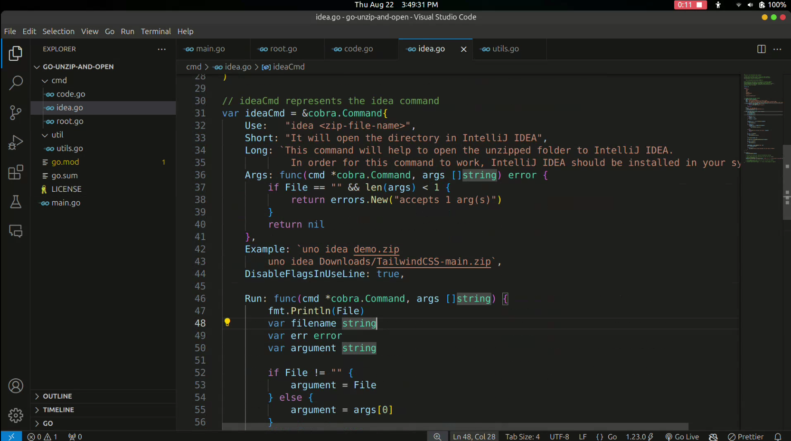

# UNO (Unzip and Open) in Go

UNO is a simple CLI tool built with Go that unzips files and opens them in a specified IDE or text editor. It provides a user-friendly interface for quickly accessing and managing your files.

## Features

- Unzip files and open them directly in Visual Studio Code or IntelliJ IDEA.
- Supports easy-to-use commands like `uno code demo.zip` or `uno idea demo.zip`.
- Managed with Cobra for efficient command-line argument handling.

## Prerequisites

- [Go](https://golang.org/doc/install) installed on your system.
- Basic understanding of Go, Cobra, and Git.

## Getting Started

### 1. Clone the Repository

Start by cloning the repository to your local machine:

```sh
git clone https://github.com/mohdaquib171/go-unzip-and-open.git
cd go-unzip-and-open
```

### 2. Build the CLI Tool

Navigate to the project directory and build the CLI tool:

```sh
go build -o uno
```

This will create an executable file named `uno` that you can use to run commands.

## How to Use

### Opening in Visual Studio Code

To unzip a file and open it in Visual Studio Code, use the following commands:

```sh
uno code <zip_file_name>.zip
```

You can also specify the file with flags:

```sh
uno code -f <zip_file_name>.zip
uno code --file <zip_file_name>.zip
```

### Opening in IntelliJ IDEA

To unzip a file and open it in IntelliJ IDEA, use the following commands:

```sh
uno idea <zip_file_name>.zip
```

You can also specify the file with flags:

```sh
uno idea -f <zip_file_name>.zip
uno idea --file <zip_file_name>.zip
```

## Demo


<!-- [](media/demo.mp4) -->
